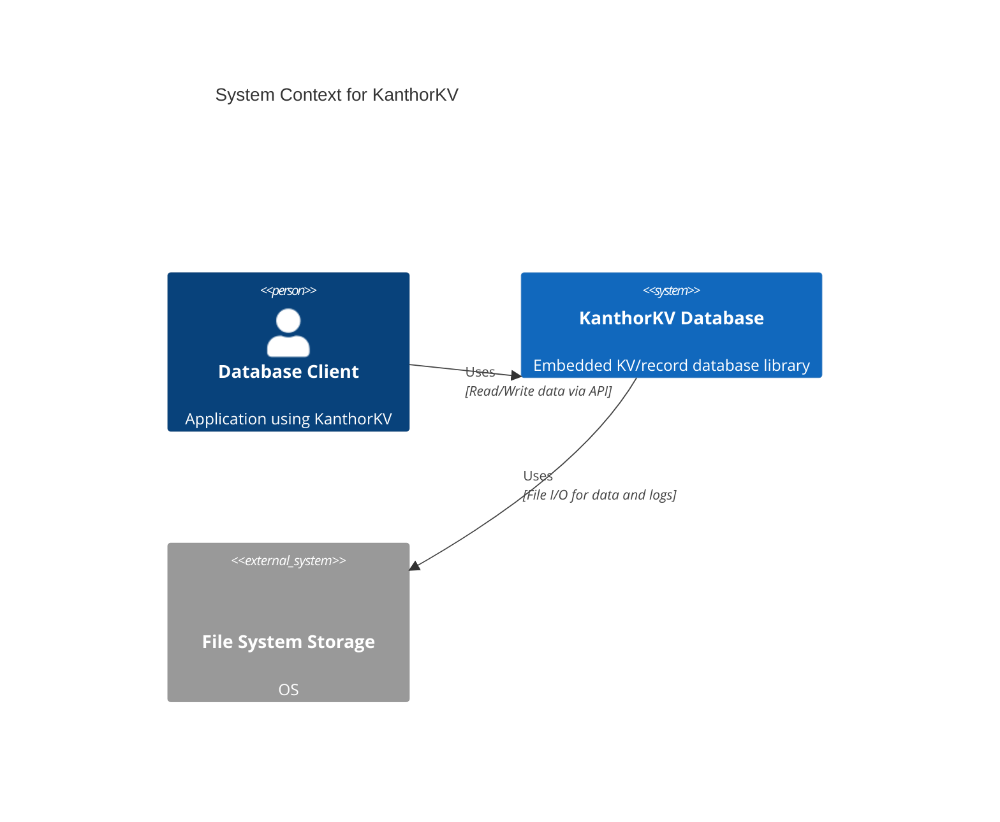
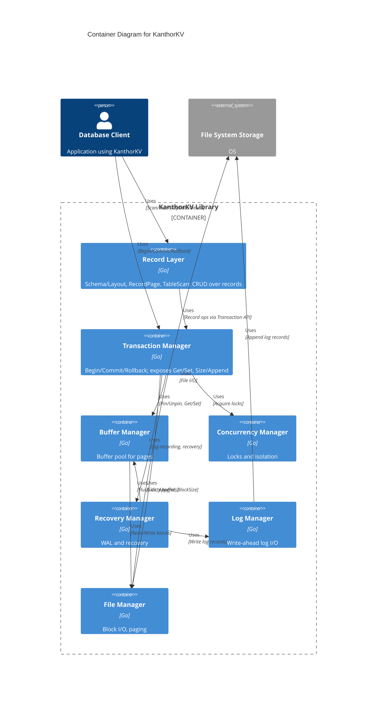
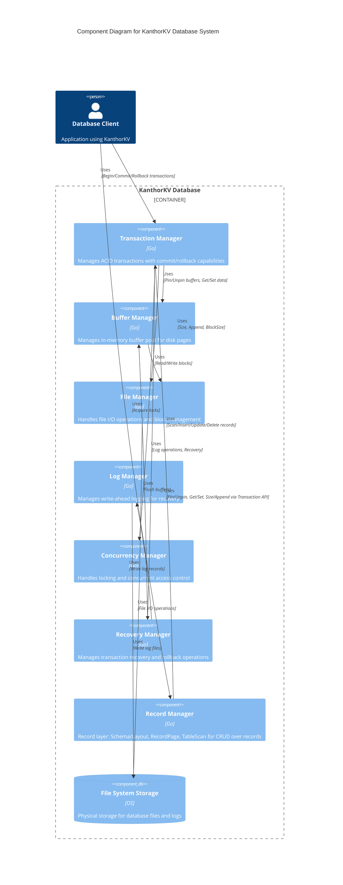

# KanthorKV Architecture Diagrams

## C4 Model - System Context

```mermaid
C4Context
    title System Context for KanthorKV

    Person(client, "Database Client", "Application using KanthorKV")
    System(kanthorkv, "KanthorKV Database", "Embedded KV/record database library")
    System_Ext(storage, "File System Storage", "OS", "Physical storage for data files and logs")

    Rel(client, kanthorkv, "Uses", "Read/Write data via API")
    Rel(kanthorkv, storage, "Uses", "File I/O for data and logs")
```

## C4 Model - Container Diagram

```mermaid
C4Container
    title Container Diagram for KanthorKV

    Person(client, "Database Client", "Application using KanthorKV")

    Container_Boundary(kanthorkv, "KanthorKV Library") {
        Container(record, "Record Layer", "Go", "Schema/Layout, RecordPage, TableScan; CRUD over records")
        Container(transaction, "Transaction Manager", "Go", "Begin/Commit/Rollback; exposes Get/Set, Size/Append")
        Container(buffer, "Buffer Manager", "Go", "Buffer pool for pages")
        Container(concurrency, "Concurrency Manager", "Go", "Locks and isolation")
        Container(recovery, "Recovery Manager", "Go", "WAL and recovery")
        Container(log, "Log Manager", "Go", "Write-ahead log I/O")
        Container(file, "File Manager", "Go", "Block I/O, paging")
    }

    System_Ext(storage, "File System Storage", "OS", "Data and log files on disk")

    Rel(client, record, "Uses", "Scan/Insert/Update/Delete")
    Rel(client, transaction, "Uses", "Begin/Commit/Rollback")
    Rel(record, transaction, "Uses", "Record ops via Transaction API")
    Rel(transaction, buffer, "Uses", "Pin/Unpin, Get/Set")
    Rel(transaction, concurrency, "Uses", "Acquire locks")
    Rel(transaction, recovery, "Uses", "Log-recording, recovery")
    Rel(transaction, file, "Uses", "Size, Append, BlockSize")
    Rel(recovery, log, "Uses", "Write log records")
    Rel(recovery, buffer, "Uses", "Flush dirty buffers")
    Rel(buffer, file, "Uses", "Read/Write blocks")
    Rel(file, storage, "Uses", "File I/O")
    Rel(log, storage, "Uses", "Append log records")
```

## C4 Model - Component Diagram

```mermaid
C4Component
    title Component Diagram for KanthorKV Database System

    Container_Boundary(kanthorkv, "KanthorKV Database") {
        Component(transaction, "Transaction Manager", "Go", "Manages ACID transactions with commit/rollback capabilities")
        Component(buffer, "Buffer Manager", "Go", "Manages in-memory buffer pool for disk pages")
        Component(file, "File Manager", "Go", "Handles file I/O operations and block management")
        Component(log, "Log Manager", "Go", "Manages write-ahead logging for recovery")
        Component(concurrency, "Concurrency Manager", "Go", "Handles locking and concurrent access control")
        Component(recovery, "Recovery Manager", "Go", "Manages transaction recovery and rollback operations")
        Component(record, "Record Manager", "Go", "Record layer: Schema/Layout, RecordPage, TableScan for CRUD over records")
        
        ComponentDb(storage, "File System Storage", "OS", "Physical storage for database files and logs")
    }
    
    Person(client, "Database Client", "Application using KanthorKV")

    Rel(client, transaction, "Uses", "Begin/Commit/Rollback transactions")
    Rel(client, record, "Uses", "Scan/Insert/Update/Delete records")
    Rel(transaction, buffer, "Uses", "Pin/Unpin buffers, Get/Set data")
    Rel(transaction, concurrency, "Uses", "Acquire locks")
    Rel(transaction, recovery, "Uses", "Log operations, Recovery")
    Rel(record, transaction, "Uses", "Pin/Unpin, Get/Set, Size/Append via Transaction API")
    Rel(transaction, file, "Uses", "Size, Append, BlockSize")
    
    Rel(buffer, file, "Uses", "Read/Write blocks")
    Rel(recovery, log, "Uses", "Write log records")
    Rel(recovery, buffer, "Uses", "Flush buffers")
    
    Rel(file, storage, "Uses", "File I/O operations")
    Rel(log, storage, "Uses", "Write log files")
    
    UpdateRelStyle(client, transaction, $offsetY="-40", $offsetX="-90")
    UpdateRelStyle(client, record, $offsetY="-10", $offsetX="80")
    UpdateRelStyle(transaction, buffer, $offsetY="-30")
    UpdateRelStyle(transaction, concurrency, $offsetX="-40")
    UpdateRelStyle(record, transaction, $offsetY="20")
    UpdateRelStyle(buffer, file, $offsetY="-20")
    UpdateRelStyle(recovery, log, $offsetX="-40")
    UpdateRelStyle(transaction, file, $offsetY="-10", $offsetX="60")
```
