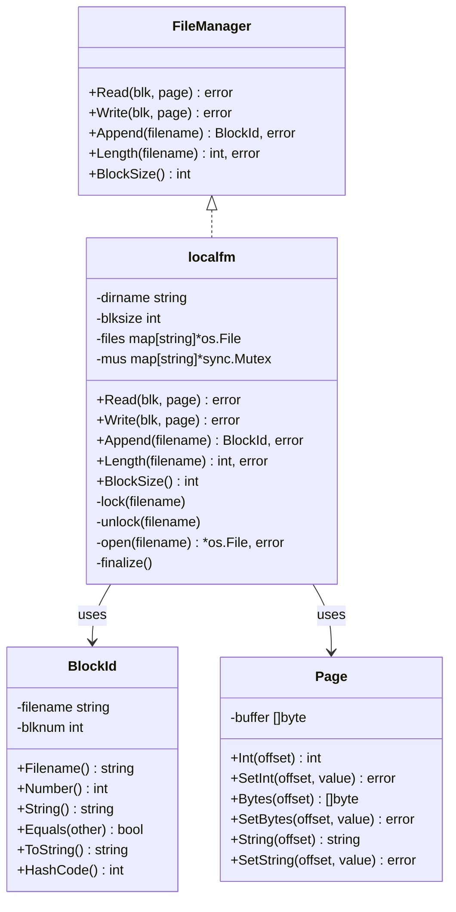

```mermaid
classDiagram
    class FileManager {
        +Read(blk, page) error
        +Write(blk, page) error
        +Append(filename) BlockId, error
        +Length(filename) int, error
        +BlockSize() int
    }
    class localfm {
        -dirname string
        -blksize int
        -files map[string]*os.File
        -mus map[string]*sync.Mutex
        +Read(blk, page) error
        +Write(blk, page) error
        +Append(filename) BlockId, error
        +Length(filename) int, error
        +BlockSize() int
        -lock(filename)
        -unlock(filename)
        -open(filename) *os.File, error
        -finalize()
    }
    class BlockId {
        -filename string
        -blknum int
        +Filename() string
        +Number() int
        +String() string
        +Equals(other) bool
        +ToString() string
        +HashCode() int
    }
    class Page {
        -buffer []byte
        +Int(offset) int
        +SetInt(offset, value) error
        +Bytes(offset) []byte
        +SetBytes(offset, value) error
        +String(offset) string
        +SetString(offset, value) error
    }

    FileManager <|.. localfm
    localfm --> BlockId : uses
    localfm --> Page : uses
```