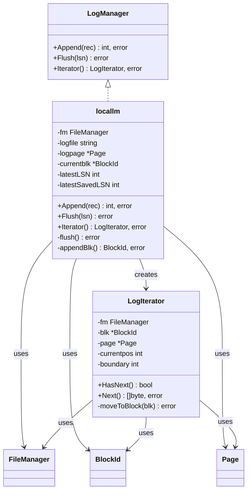

```mermaid
classDiagram
    class LogManager {
        +Append(rec) int, error
        +Flush(lsn) error
        +Iterator() LogIterator, error
    }
    class locallm {
        -fm FileManager
        -logfile string
        -logpage *Page
        -currentblk *BlockId
        -latestLSN int
        -latestSavedLSN int
        +Append(rec) int, error
        +Flush(lsn) error
        +Iterator() LogIterator, error
        -flush() error
        -appendBlk() BlockId, error
    }
    class LogIterator {
        -fm FileManager
        -blk *BlockId
        -page *Page
        -currentpos int
        -boundary int
        +HasNext() bool
        +Next() []byte, error
        -moveToBlock(blk) error
    }
    class FileManager
    class BlockId
    class Page

    LogManager <|.. locallm
    locallm --> FileManager : uses
    locallm --> BlockId : uses
    locallm --> Page : uses
    locallm --> LogIterator : creates
    LogIterator --> FileManager : uses
    LogIterator --> BlockId : uses
    LogIterator --> Page : uses
```