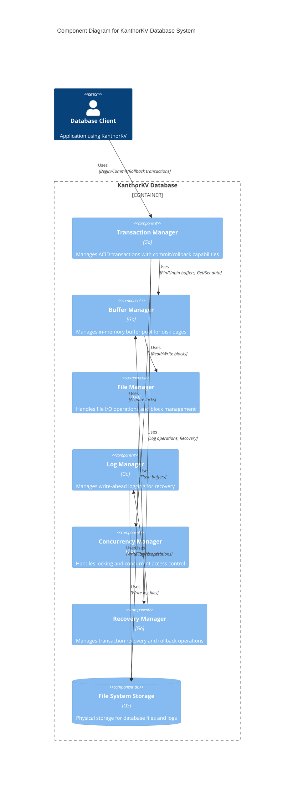
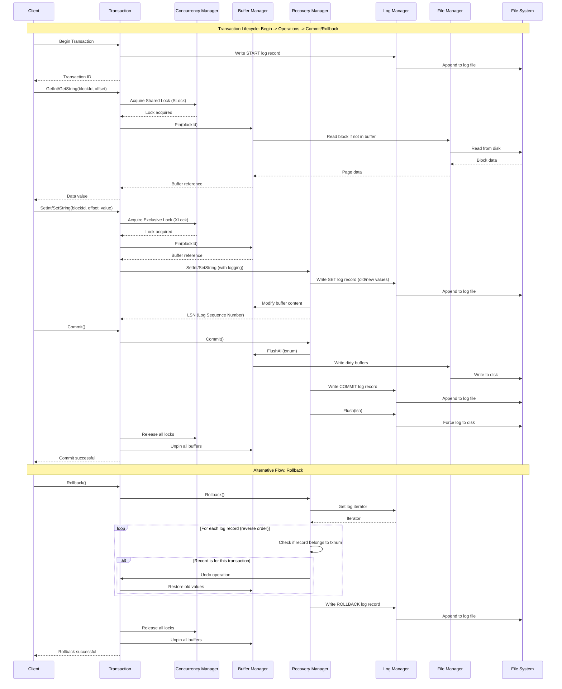

# KanthorKV Architecture Diagrams

## C4 Model - Component Relationship Diagram

```mermaid
C4Component
    title Component Diagram for KanthorKV Database System

    Container_Boundary(kanthorkv, "KanthorKV Database") {
        Component(transaction, "Transaction Manager", "Go", "Manages ACID transactions with commit/rollback capabilities")
        Component(buffer, "Buffer Manager", "Go", "Manages in-memory buffer pool for disk pages")
        Component(file, "File Manager", "Go", "Handles file I/O operations and block management")
        Component(log, "Log Manager", "Go", "Manages write-ahead logging for recovery")
        Component(concurrency, "Concurrency Manager", "Go", "Handles locking and concurrent access control")
        Component(recovery, "Recovery Manager", "Go", "Manages transaction recovery and rollback operations")
        
        ComponentDb(storage, "File System Storage", "OS", "Physical storage for database files and logs")
    }
    
    Person(client, "Database Client", "Application using KanthorKV")

    Rel(client, transaction, "Uses", "Begin/Commit/Rollback transactions")
    Rel(transaction, buffer, "Uses", "Pin/Unpin buffers, Get/Set data")
    Rel(transaction, concurrency, "Uses", "Acquire locks")
    Rel(transaction, recovery, "Uses", "Log operations, Recovery")
    
    Rel(buffer, file, "Uses", "Read/Write blocks")
    Rel(recovery, log, "Uses", "Write log records")
    Rel(recovery, buffer, "Uses", "Flush buffers")
    
    Rel(file, storage, "Uses", "File I/O operations")
    Rel(log, storage, "Uses", "Write log files")
    
    UpdateRelStyle(client, transaction, $offsetY="-40", $offsetX="-90")
    UpdateRelStyle(transaction, buffer, $offsetY="-30")
    UpdateRelStyle(transaction, concurrency, $offsetX="-40")
    UpdateRelStyle(buffer, file, $offsetY="-20")
    UpdateRelStyle(recovery, log, $offsetX="-40")
```

## Transaction Sequence Diagram

```mermaid
sequenceDiagram
    participant Client
    participant Transaction
    participant ConcurrencyMgr as Concurrency Manager
    participant BufferMgr as Buffer Manager
    participant RecoveryMgr as Recovery Manager
    participant LogMgr as Log Manager
    participant FileMgr as File Manager
    participant Storage as File System

    Note over Client, Storage: Transaction Lifecycle: Begin -> Operations -> Commit/Rollback

    %% Transaction Begin
    Client->>Transaction: Begin Transaction
    Transaction->>LogMgr: Write START log record
    LogMgr->>Storage: Append to log file
    Transaction-->>Client: Transaction ID

    %% Data Operations (Read)
    Client->>Transaction: GetInt/GetString(blockId, offset)
    Transaction->>ConcurrencyMgr: Acquire Shared Lock (SLock)
    ConcurrencyMgr-->>Transaction: Lock acquired
    Transaction->>BufferMgr: Pin(blockId)
    BufferMgr->>FileMgr: Read block if not in buffer
    FileMgr->>Storage: Read from disk
    Storage-->>FileMgr: Block data
    FileMgr-->>BufferMgr: Page data
    BufferMgr-->>Transaction: Buffer reference
    Transaction-->>Client: Data value

    %% Data Operations (Write)
    Client->>Transaction: SetInt/SetString(blockId, offset, value)
    Transaction->>ConcurrencyMgr: Acquire Exclusive Lock (XLock)
    ConcurrencyMgr-->>Transaction: Lock acquired
    Transaction->>BufferMgr: Pin(blockId)
    BufferMgr-->>Transaction: Buffer reference
    Transaction->>RecoveryMgr: SetInt/SetString (with logging)
    RecoveryMgr->>LogMgr: Write SET log record (old/new values)
    LogMgr->>Storage: Append to log file
    RecoveryMgr->>BufferMgr: Modify buffer content
    RecoveryMgr-->>Transaction: LSN (Log Sequence Number)

    %% Transaction Commit
    Client->>Transaction: Commit()
    Transaction->>RecoveryMgr: Commit()
    RecoveryMgr->>BufferMgr: FlushAll(txnum)
    BufferMgr->>FileMgr: Write dirty buffers
    FileMgr->>Storage: Write to disk
    RecoveryMgr->>LogMgr: Write COMMIT log record
    LogMgr->>Storage: Append to log file
    RecoveryMgr->>LogMgr: Flush(lsn)
    LogMgr->>Storage: Force log to disk
    Transaction->>ConcurrencyMgr: Release all locks
    Transaction->>BufferMgr: Unpin all buffers
    Transaction-->>Client: Commit successful

    %% Alternative: Transaction Rollback
    Note over Client, Storage: Alternative Flow: Rollback
    Client->>Transaction: Rollback()
    Transaction->>RecoveryMgr: Rollback()
    RecoveryMgr->>LogMgr: Get log iterator
    LogMgr-->>RecoveryMgr: Iterator
    loop For each log record (reverse order)
        RecoveryMgr->>RecoveryMgr: Check if record belongs to txnum
        alt Record is for this transaction
            RecoveryMgr->>Transaction: Undo operation
            Transaction->>BufferMgr: Restore old values
        end
    end
    RecoveryMgr->>LogMgr: Write ROLLBACK log record
    LogMgr->>Storage: Append to log file
    Transaction->>ConcurrencyMgr: Release all locks
    Transaction->>BufferMgr: Unpin all buffers
    Transaction-->>Client: Rollback successful
```
