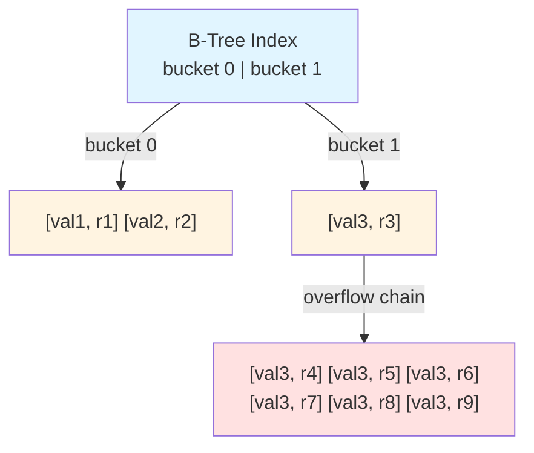

# Index

## Works

## Notes

- Insert an index into B-tree block when splitting a data block.
    -  If there are at least two different datavals in the block, then it splits.
    -  If the block is full with same value records, then another overflow block is created and chained to the existing one.

